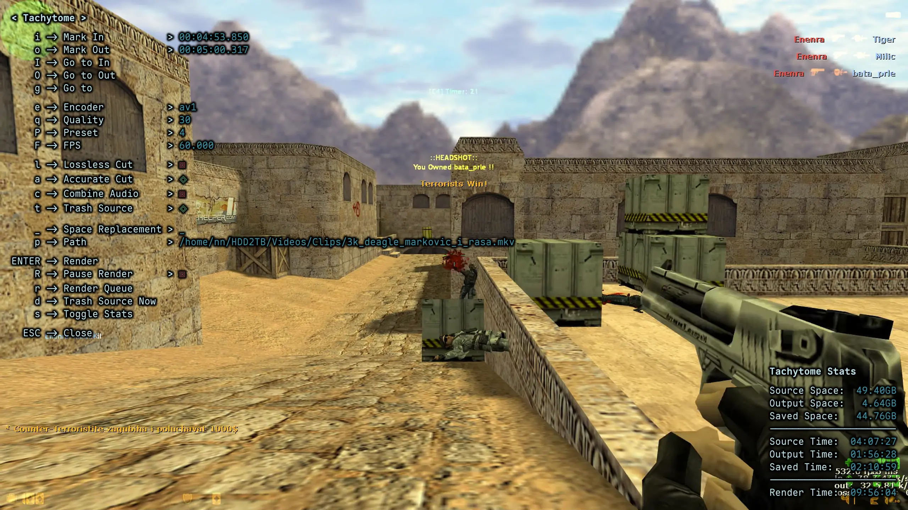

# Tachytome

Tachos (τάχος) – Speed<br>
Tome &nbsp;&nbsp;(τομή) &nbsp;– Cut

Keyboard Driven, AV1/H265/Lossless, MPV Video Cutter.

<a href="https://youtu.be/PoyvYFPhrfI">
  
</a>

*Click the image to view a quick showcase of Tachytome capabilities.*

## Table of Contents

- [Why Tachytome?](#why-tachytome)
- [Installation](#installation)
  - [Dependencies](#dependencies)
  - [Clone](#clone)
  - [Submodule](#submodule)
- [Usage](#usage)
  - [Quickstart](#quickstart)
  - [Keymap](#keymap)
  - [Config](#config)
  - [Recovery](#recovery)
  - [Go To](#go-to)
  - [Path](#path)
- [Contributing](#contributing)
- [Donations](#donations)
- [AI](#ai)

## Why Tachytome?

Cutting clips was always an exhausting chore for me.<br>
I would clip something, navigate to it, open a video editor/cutting utility, drag and drop or paste the path, and so on.<br>
Now consider the fact I have ~1TB of clips.<br>
I built Tachytome to make cutting clips fun, easy and fast.<br>
You run into a good clip, and Tachytome is right there, ready to cut the important part with the settings of your choice.<br>
No more copying paths, no more external software with poor UX, it's all there, right in your video player.

## Installation

### Dependencies

- [ffmpeg](https://ffmpeg.org/) - needed for all the video operations.
- [gio](https://www.gtk.org/docs/architecture/glib)/[trash](https://github.com/andreafrancia/trash-cli) - needed on Linux for trashing files.

*gio is preinstalled on most distributions*

- Arch
```sh
sudo pacman -S ffmpeg
```

- Mac
```sh
brew install ffmpeg
```

- Windows
```sh
winget install -e --id Gyan.FFmpeg
```

### Clone

You may clone the repo directly to your config:

- Unix
```sh
git clone https://git.nnstdios.com/nnra6864/tachytome ~/.config/mpv/scripts/tachytome
```

- Windows (Powershell)
```sh
git clone https://git.nnstdios.com/nnra6864/tachytome "$env:APPDATA/mpv/scripts/tachytome"
```

### Submodule

If you are source controlling your dotfiles, consider adding Tachytome as a submodule:

- Unix
```sh
git submodule add ../../nnra6864/tachytome ~/.config/mpv/scripts/tachytome
```

- Windows (Powershell)
```sh
git submodule add ../../nnra6864/tachytome "$env:APPDATA/mpv/scripts/tachytome"
```

> [!NOTE]
> `../../` in the link makes git use the same server as your root repo.<br>
> For example, if your dotfiles are hosted on `https://github.com/name/dotfiles`, double `../` will make it go up twice in the URL, ending up with `https://github.com/`, and then appending `nnra6864/tachytome` to that, resulting in `https://github.com/nnra6864/tachytome`

## Usage

Tachytome is entirely keyboard driven.<br>
All the binds are isolated into a submap (Tachytome menu), which you can access by pressing `t` by default.<br>
This is done to avoid global bind conflicts.

### Quickstart

- `t` to open the Tachytome menu.
- `g` and type in `10` to go to 10 seconds of your video.
- `i` to mark in.
- `g` and type in `90%` to go to 90% of your video.
- `o` to mark out.
- `I` and `O` to make sure mark in and out are good.
- `p` to set the name of your video.
- `Enter` to start the render.
- `r` to access the render queue.

### Keymap

| Keybind | Action | Description              |
|---------|--------|--------------------------|
| t       | Menu   | Open the Tachytome menu. |
| g       | Go To  | Open the Go To menu.     |

- Menu

| Keybind | Action            | Description                                                                                                   |
|---------|-------------------|---------------------------------------------------------------------------------------------------------------|
| i       | Mark In           | Mark the start of the video.                                                                                  |
| o       | Mark Out          | Mark the end of the video.                                                                                    |
| I       | Go To In          | Go to Mark In.                                                                                                |
| O       | Go To Out         | Go to Mark Out.                                                                                               |
| g       | Go To             | Go to a precise location in the video.<br>Learn more about [Go To](#go-to).                                   |
|---------|-------------------|---------------------------------------------------------------------------------------------------------------|
| e       | Encoder           | Set the video encoder.                                                                                        |
| q       | Quality           | Set the video encoder quality parameter.                                                                      |
| P       | Preset            | Set the video encoder preset parameter.                                                                       |
| F       | FPS               | Set the FPS of the video.                                                                                     |
|---------|-------------------|---------------------------------------------------------------------------------------------------------------|
| l       | Lossless Cut      | Toggle the lossless cut option.                                                                               |
| a       | Accurate Cut      | Toggle accurate cut.<br>Makes cuts millisecond precise, but may cause a slight delay before rendering starts. |
| c       | Combine Audio     | Toggle the combine audio option.                                                                              |
| t       | Trash Source      | Toggle trashing of the source file.                                                                           |
|---------|-------------------|---------------------------------------------------------------------------------------------------------------|
| _       | Space Replacement | Set the character to replace spaces with.                                                                     |
| p       | Path              | Set Output path.<br>Learn more about [Path](#path).                                                           |
|         |                   |                                                                                                               |
| Enter   | Render            | Start the render of the output file.                                                                          |
| R       | Pause Render      | Pause the current render and render queue.<br>Can only pause the render queue on Windows.                     |
| r       | Render Queue      | Open the render queue menu.                                                                                   |
| d       | Trash Source Now  | Trash the source file.                                                                                        |
| s       | Stats             | Display Tachytome stats.                                                                                      |
|---------|-------------------|---------------------------------------------------------------------------------------------------------------|
| Esc     | Close             | Close the currently active menu.                                                                              |

- Render Queue

| Keybind     | Action        | Description                                                                                |
|-------------|---------------|--------------------------------------------------------------------------------------------|
| Enter       | Pause Render  | Pauses the current render and render queue.<br>Can only pause the render queue on Windows. |
| p           | Change Path   | Change output path.                                                                        |
| d           | Delete        | Deletes the item from the render queue.                                                    |

- Path

| Keybind     | Action   | Description                      |
|-------------|----------|----------------------------------|
| Up/ctrl+k   | Previous | Select previous item in history. |
| Down/ctrl+j | Next     | Select next item in history.     |

- Lists (Render Queue, Preset etc.)

| Keybind     | Action        | Description              |
|-------------|---------------|--------------------------|
| Up/ctrl+k   | Navigate Up   | Navigates to item above. |
| Down/ctrl+j | Navigate Down | Navigates to item below. |

### Config

You can configure Tachytome with the `mpv/script-opts/tachytome.conf` file.<br>
It should get automatically generated on the first launch.<br>
You can find that same example config [here](./tachytome.conf).<br>
The example config contains detailed explanations of all the settings, I would highly suggest reading it.

To change the default Tachytome binds, add the following to your `mpv/input.conf`:
```
t script-binding tachytome/menu
g script-binding tachytome/goto
```
Replace `t` and `g` with keys of your choice.

### Recovery

Tachytome gracefully handles crashes and accidental closes.<br>
Render queues are stored as files tied to the mpv PID.<br>
Every time you start a new mpv instance, the script checks if any of these are present without an active mpv instance.<br>
It then asks you whether you want to recover, discard or ignore the queue.

### Go To

Tachytome includes a really powerful Go To implementation.<br>
On top of many input types, it also supports relative jumps.

- Prefix

You can prefix `+` or `-` to make go to relative to the current time.

- HH:MM:SS.MS

This is arguably the most versatile format as you can do `30` to go to 30 seconds, but also `1:2.50` to go to 1 minute 2 seconds 500 milliseconds.

- Suffix

This is a convenient format to jump across minutes, hours etc.<br>
Instead of having to type `1:0`, you simply type `1m` to go to 1 minute.

| Suffix | Value       |
|--------|-------------|
| ms     | millisecond |
| s      | second      |
| m      | minute      |
| h      | hour        |
| d      | day         |
| f      | frame       |
| %      | percent     |

- Examples

| Input  | Goes To             |
|--------|---------------------|
| `+30`  | 30 seconds ahead    |
| `2:0`  | 2 minutes           |
| `1:13` | 1 minute 13 seconds |
| `3m`   | 3 minutes           |
| `50ms` | 50 milliseconds     |
| `-60f` | 60 frames back      |
| `5%`   | 5%                  |

### Path

Tachytome offers powerful path resolution.<br>
Config includes the `output_dir` option which you can set to the path you most commonly use, by default `~/Videos/Tachytome`.

- Prefixes

| Prefix | Resolves To                                    |
|--------|------------------------------------------------|
|        | Relative to the configured output_dir.         |
| ~      | Home on Unix, user directory on Windows.       |
| /      | Root directory.                                |
| ./     | Directory where the source file is.            |
| ../    | Parent directory of the configured output_dir. |

- Examples

| Input      | Resolves To                    |
|------------|--------------------------------|
| CutClip    | ~/Videos/Tachytome/CutClip.mkv |
| ~/CutClip  | ~/CutClip.mkv                  |
| /CutClip   | /CutClip.mkv                   |
| ./CutClip  | /path-to-source/CutClip.mkv    |
| ../CutClip | ~/Videos/CutClip.mkv           |


## Contributing

If you are interested in contributing, feel free to just open a PR.<br>
The only thing I ask you to do is follow the [commit naming convention](https://www.conventionalcommits.org/en/v1.0.0/).<br>
AI is allowed as long as you fully review, understand and, most importantly, test the code.

## Donations

Whilst Tachytome is entirely free, both as in speech and beer, I do highly appreciate donations as they are my only source of income.
- [Liberapay](https://liberapay.com/nnra6864/)
- [Ko-fi](https://ko-fi.com/nnra6864)

## AI

AI was heavily used in the making of Tachytome.<br>
As I am not yet familiar with Greek, I asked AI for Greek Eastern Orthodox words that would fit my app, and then combined the 2 suggestions.<br>
On top of that, AI wrote most of the code for me as I genuinely don't enjoy [Lua](https://www.lua.org/).<br>
To be precise:
1. I gave it my original [fish](https://fishshell.com/) script, [spc](https://git.nnstdios.com/nnra6864/Ricerland/src/branch/nous/.config/fish/functions/spc.fish).
2. Wrote instructions in pseudocode style that it translated to Lua.
3. Dictated the exact structure of the code.

In short, whilst AI did write the code itself, the logic/structure, README and the original idea came from me, not the AI.<br>
If that doesn't sit well with you, this repo is [CC0](https://creativecommons.org/publicdomain/zero/1.0/) licensed, so feel free to do whatever you want with the code and the idea, it's a gift.

# ☦

```
   Ὤ
 Ὁ   Ν
Ι̅Ϲ̅ │ Χ̅Ϲ̅
───┼───
ΝΙ │ ΚΑ
   ☦
```

Εἰς δόξαν τοῦ Θεοῦ<br>
*To the glory of God*

Τῇ Ὑπεραγίᾳ Θεοτόκῳ δόξα<br>
*Glory to the Most Holy Theotokos*

Δόξα τῷ Θεῷ πάντων ἕνεκεν<br>
*Glory to God for all things*

ΑΜΗΝ

☦
